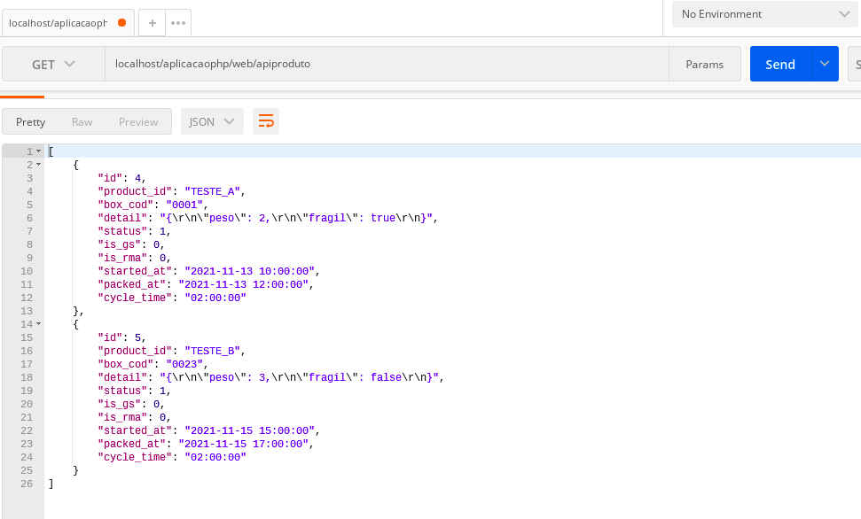

<p align="center">
    <a href="https://github.com/yiisoft" target="_blank">
        
    </a>
    <h1 align="center">Desafio Técnico ICTS</h1>
</p>


<br>

---
*Para a criação da aplicação foi utilizado o GII para a geração de Módulos, Controladores, Views e CRUD.*

## - Para acessar a aplicação
~~~
http://localhost/aplicacaophp/web/
~~~
### - Rota Default
```php
'defaultRoute' => 'produto/index'
```

<br>

---
## - Tela CRUD Produto
~~~
http://localhost/aplicacaophp/web/produto/index
~~~

### - Create
~~~
http://localhost/aplicacaophp/web/produto/create
~~~


<br>

### - Read Produto
~~~
http://localhost/aplicacaophp/web/produto/index
~~~ 


<br>

### - Update Produto


<br>

### - Delete Produto
*O delete ocorre dentro do Read e Update.*

<br>

---
## - Tela CRUD Serial
~~~
http://localhost/aplicacaophp/web/serial/index
~~~

### - Create Serial
~~~
http://localhost/aplicacaophp/web/serial/create
~~~


<br>

### - Read Serial
~~~
http://localhost/aplicacaophp/web/serial/index
~~~


<br>

### - Update Serial


<br>

### - Delete Serial
*O delete ocorre dentro do Read e Update.*

---
## - Tela Banco Produto


<br>

## - Tela Banco Serial


<br>

---
## - API retorno via postman
*Não consegui retornar um JSON sem o postman.*
### - API Produto
~~~
http://localhost/aplicacaophp/web/apiproduto
~~~


<br>

### - API Serial
~~~
http://localhost/aplicacaophp/web/apiserial
~~~


---